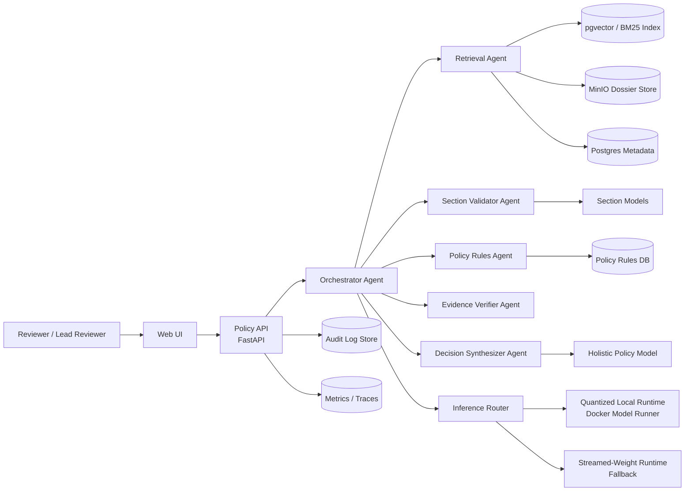
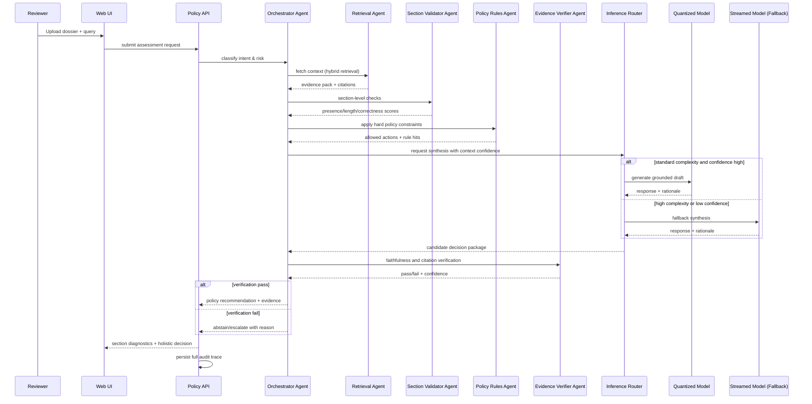
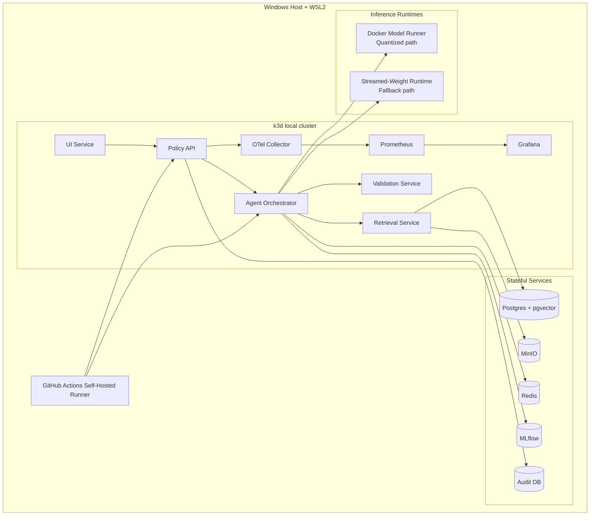
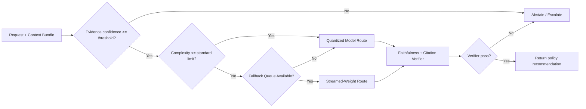
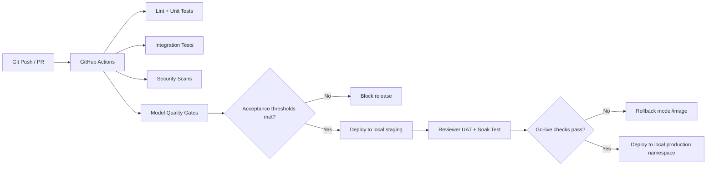

# Dossier Review AI Assistant Architecture Diagrams

## Diagram 1: System Context (Policy-First)

## Diagram 2: Agentic RAG Decision Flow

## Diagram 3: Local Deployment Topology (Laptop-First)

## Diagram 4: Inference Routing (Quantization + Weight Streaming)

## Diagram 5: CI/CD and Quality Gates
